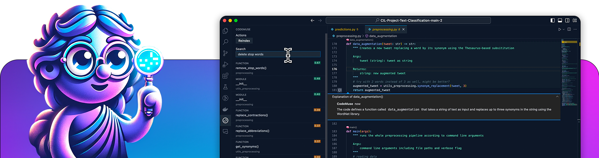

# CodeMuse: Get the fun coding back !
1. [Introduction](#introduction)
   - [Problem](#problem)
   - [Solution](#solution)
3. [Features](#features)
   - [Code Navigation with AI](#code-navigation-with-ai)
   - [Automated and Intelligent Documentation](#automated-and-intelligent-documentation)
4. [Getting Started](#getting-started)
   - [Installation and Log In](#installation-and-log-in)
   - [How-to Video](#how-to-video)
5. [Tech Stack](#tech-stack)
6. [Story](#story)
7. [Contributing](#contributing)
8. [Our Team](#our-team)

# Introduction

**[CodeMuse](https://www.codemuse.app/)** is an AI code assistant that works hand in hand with the developer, and automates the boring parts of coding.

https://github.com/codemuse-app/codemuse/assets/33000377/6504f95d-9aec-4f80-8d3f-f529d8fbbff2

**CodeMuse** is an innovative AI code assistant, designed to revolutionize the coding experience. It specializes in speeding up the onboarding process of a repository, enabling developers to focus on what truly matters. Its standout features include an automatically-generated graph and semantic index of codebases, automated documentation, and semantic browsing for a deeper understanding of code elements. Furthermore, **CodeMuse** assists in real-time as you type and can even convert business needs into actionable code changes. This tool promises to bring back the joy and creativity in coding by automating the mundane aspects, letting developers focus on the fun parts of coding.

## Problem
✅ Human resources are more dynamic now than ever. We can scale teams up and down in a matter of days.  
❌ However, for software engineers, diving into an unfamiliar codebase often means hours, if not days, of navigating through complex code to grasp its structure and functionality. This is not just daunting but also a drain on productivity and efficiency. What’s worse, business and technical documentations are often outdated or not aligned. This leads to confusion, inefficiencies and regressions when working on larger codebases.

## Solution
Our [CodeMuse VSCode Extension](https://marketplace.visualstudio.com/items?itemName=codemuse-app.codemuse&ssr=false#overview) solve theses issues thanks to feature like code search and automated documentation! With our VSCode extension, getting started is as effortless as downloading the extension and logging in. Search is snappy and to the point. Documentation is readily available, from your IDE. This hassle-free approach, complemented by comprehensive documentation and how-to videos, ensures a seamless integration into your existing workflow. Currently optimized for Python, JavaScript and TypeScript projects, we are actively working on expanding our support to include more programming languages and other popular IDEs.

> [!NOTE]
> ### What Makes CodeMuse Unique ?  
> Unlike traditional tools, CodeMuse uses AI and semantic tools to create a real-time experience, allowing you to seamlessly use our tool while coding without ever needing to exit your workflow. Shipped as a VSCode extension, we aim at maintaining an uninterrupted coding experience, ensuring that assistance from CodeMuse is always just a keystroke away, integrated directly into your daily coding activities.

# Features

- 🔍 **Search**: **CodeMuse** allows you to search on an automatically-generated graph and semantic index of your codebase, including business descriptions, using natural language query.
- 📄 **Automated Documentation**: **CodeMuse** automatically generates developer and business-oriented documentation.
- 🧑‍💻 **************************************************Key-up assistant**************************************************: [in progress]
- 🤖 **Code implementation**: [in progress]

### Code Navigation with AI

Code navigation is our cornerstone feature, designed to streamline the way developers interact with codebases. Whether you're looking for specific functionality, business logic, or just a particular keyword, CodeMuse brings you the relevant code snippets in milliseconds. We ditch the “chat-like” experience for snappy, relevant links to your codebase.

https://github.com/codemuse-app/codemuse/assets/33000377/1cad0c66-c840-4ec1-9352-7977d1e6cb13

### Automated and Intelligent Documentation

Automated recursive documentation gives a proper understanding of each and every function of a codebase. As you browse, CodeMuse describes the role of functions, classes or modules based on a deep semantic graph and AI extraction. This prevents you from digging through multiple files, and bridges the communication between developers and project managers.

https://github.com/codemuse-app/codemuse/assets/33000377/ed3c0454-ccdc-4980-bc13-c957ec377847

# Getting Started

### Installation and Log In

CodeMuse Alpha can be downloaded from the VSCode extension marketplace. You should be able to install it and start using it in your current projects. You can also search for `CodeMuse` in the VSCode extension panel.

If you wish to use the `.vsix` file for a manual installation, you can get the extension from the marketplace and use the `Download extension` link. You can then follow the [manual installation instructions](https://code.visualstudio.com/docs/editor/extension-marketplace#_install-from-a-vsix).

You can also have a look at our extensive [documentation](https://codemuse.notion.site/a09cd839084048b0bf49dcd98540d01b?v=3cbf6b9c75fe431aa54927ca0ee7b584) to get more details about the extension.

### How-to Video
Find here a simple [video](https://www.youtube.com/watch?v=8JmVMXH8kq4) on how to use [CodeMuse VSCode Extension](https://marketplace.visualstudio.com/items?itemName=codemuse-app.codemuse&ssr=false#overview), from installation to your first search query !

# Tech Stack

- Embedding: [all-mpnet-based-v2](https://huggingface.co/sentence-transformers/all-mpnet-base-v2)
- Doc Generation: [code-llama-7B-instruct-hf](https://huggingface.co/codellama/CodeLlama-7b-Instruct-hf)
- Code Indexing: [scip](https://sourcegraph.com/github.com/sourcegraph/scip)
- Cloud Infrastructure: [Modal Labs](https://modal.com/)
- Performance Monitoring & Error Tracking: [Sentry](https://sentry.io/)

# Story

Inspired by the challenges of onboarding developers onto large projects and the disconnect between project managers and technical teams we faced off during our previous experiences, **CodeMuse** was born. 

We recognized that even small tasks like bug fixes and minor features demanded extensive codebase navigation. Our solution? Harnessing advanced AI to transform code exploration into a natural language process, dramatically reducing the learning curve. **CodeMuse** also provides intuitive business documentation, easing the understanding of code from a business perspective.

Join us at **CodeMuse**, where we're making coding more accessible and bridging the gap between technical complexity and business strategy.

# Contributing

Join us in shaping **CodeMuse**! Start by exploring our free access plan and share your feedback. Your insights are vital in refining our solution. Connect with us on our Discord channel, where you can discuss with our dev team and fellow users, contributing to the evolution of a tool that meets everyone's needs. Encounter an issue? Submit a ticket error promptly for a swift resolution. For those keen on a deeper involvement or with ideas for improvement, reach out to us directly. Your active contribution can significantly impact this project's success. Let's build something extraordinary together!

[**Join our Discord!**](https://discord.gg/KSzM9kFq)

[**Follow us on X**](https://twitter.com/CodeMuseApp) and [**LinkedIn**](https://www.linkedin.com/company/codemuse)!

[**Stay Tuned !**](https://www.codemuse.app/get-involved)

# Our Team

### [Dorge Pierre](https://www.linkedin.com/in/pierre-dorge-3372bb16a/)

EPF Lausanne and ETH Zürich graduate in Computer Science specializing in machine intelligence and information security. Pierre built extensive experience in software engineering and data management as the co-founder of a IT consulting company and now decided to focus on revolutionising the developer experiences.

### [Launay Titouan](https://www.linkedin.com/in/titouan-launay/)

INSA Lyon graduate in civil engineering and architecture, Titouan is a self-taught computer programmer, developing and selling software to businesses since the age of 12. Co-founded an IT consulting company while studying, providing companies with data management and cloud consulting services. He now puts his effort into improving DX around the world. 

### [Lefevre Auguste](https://www.linkedin.com/in/augustelefevre/)

EPF Lausanne and ETH Zürich graduate in Computer Science, Auguste built extensive knowledge in machine intelligence and data analytics. Continuing his academic journey with a  PhD in Quantitative Finance at the National University of Singapore, he left to co-found CodeMuse with Pierre and Titouan with the idea to reshape the developer experience.
