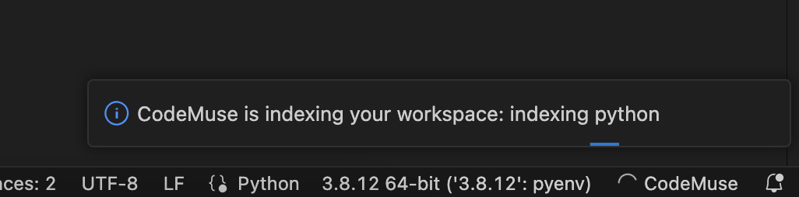

# CodeMuse VSCode Extension: Get the fun coding back!

[**CodeMuse**](https://www.codemuse.app/) is your innovative AI code assistant, designed to revolutionize your coding experience. With its unique features like an automatically-generated graph and semantic index, automated documentation, and semantic browsing, **CodeMuse** not only speeds up the onboarding process but also enhances your understanding of complex code elements. It's here to automate the mundane and let you focus on the creative aspects of coding.

[Join the Discord !](linktodsicord)

## Features

- 🔍 **Search**: Effortlessly navigate your codebase with natural language queries.
- 📄 **Automated Documentation**: Get both developer and business-oriented documentation, automatically.
- 🧑‍💻 **Key-up Assistant**: Real-time coding assistance as you type. [In Progress]
- 🤖 **Code Implementation**: Transform business needs into code changes. [In Progress]

## Get Started

Download CodeMuse Alpha from the VSCode extension marketplace or use the `.vsix` file for manual installation. Full instructions and a link for manual installation are provided. Restart VSCode after installation to activate CodeMuse. For detailed information about the features, troubleshsooting and more, please visit our [documentation page](https://codemuse.notion.site/a09cd839084048b0bf49dcd98540d01b?v=3cbf6b9c75fe431aa54927ca0ee7b584&pvs=4)

Upon installation, you will need to restart Visual Studio Code for the changes to take effect. When you open a new workspace with supported language files and/or open the CodeMuse sidebar, CodeMuse will start indexing your project. Step by step guide:

- 🤖 [Indexing](https://codemuse.notion.site/Indexing-dec4f5aa0881452a91856b381bf458f3?pvs=4)
- 🔍 [First Search](https://codemuse.notion.site/First-search-65d61dfc2a504222b624e9f088c15bab?pvs=4)
- 📄 [Automated Documentation](https://codemuse.notion.site/Automated-docs-2b94c50852e54440983b589b78a9d5dc?pvs=4)

<!---
Upon installation, you will need to restart Visual Studio Code for the changes to take effect. When you open a new workspace with supported language files and/or open the CodeMuse sidebar, CodeMuse will start indexing your project. Step by step guide:

- 🤖 [Indexing](https://codemuse.notion.site/Indexing-dec4f5aa0881452a91856b381bf458f3?pvs=4) 
*Example of a progress notification, as well as the spinning status bar symbol for CodeMuse.*

- 🔍 [First Search](https://codemuse.notion.site/First-search-65d61dfc2a504222b624e9f088c15bab?pvs=4)
*Query results, with associated relative score and relevancy indicator.*

- 📄 [Automated Documentation](https://codemuse.notion.site/Automated-docs-2b94c50852e54440983b589b78a9d5dc?pvs=4)
*CodeMuse auto-generated documentation for a Python method.*

--->

 <!---

Upon installation, you will need to restart Visual Studio Code for the changes to take effect. When you open a new workspace with supported language files and/or open the CodeMuse sidebar, CodeMuse will start indexing your project.
- 🤖 [Indexing](https://codemuse.notion.site/Indexing-dec4f5aa0881452a91856b381bf458f3?pvs=4)
   
  
   
  *Example of a progress notification, as well as the spinning status bar symbol for CodeMuse.*

- 🔍 [First Search](https://codemuse.notion.site/First-search-65d61dfc2a504222b624e9f088c15bab?pvs=4)
   
  
   
  *Query results, with associated relative score and relevancy indicator.*

- 📄 [Automated Documentation](https://codemuse.notion.site/Automated-docs-2b94c50852e54440983b589b78a9d5dc?pvs=4)
   
  
   
  *CodeMuse auto-generated documentation for a Python method.*

  --->

## Tech Stack

- Embedding: [all-mpnet-based-v2](https://huggingface.co/sentence-transformers/all-mpnet-base-v2)
- Doc Generation: [code-llama-7B-instruct-hf](https://huggingface.co/codellama/CodeLlama-7b-Instruct-hf)
- Code Indexing: [scip](https://sourcegraph.com/github.com/sourcegraph/scip)
- Cloud Infrastructure: [Modal Labs](https://modal.com/)
- Monitoring & Error Tracking: [Sentry](https://sentry.io/)

## Contributing

Your feedback is crucial! Explore our free access plan, join our Discord channel for discussions, or submit ticket errors for quick resolutions. Direct contact for improvement suggestions or active contributions is always welcome.

[Join our Discord](https://discord.com/invite/uRJE6e2rgr)!
 
Submit an [issue](issueformlink) !

## How Can I Help?

Love our extension? Rate us ⭐⭐⭐⭐⭐ on the [Visual Studio Marketplace](https://marketplace.visualstudio.com/items?itemName=codemuse-app.codemuse&ssr=false#review-details) and [join our Discord](https://discord.com/invite/uRJE6e2rgr) to be a part of our user community, providing invaluable feedback and shaping our product's future!
